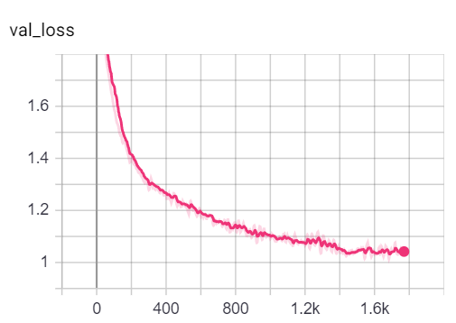
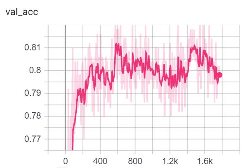

## GAT - Graph Attention Network (PyTorch) 
This repo contains a PyTorch implementation of the original GAT paper (:link: [Veličković et al.](https://arxiv.org/abs/1710.10903)).  
It's aimed at making it **easy to start playing and learning** about GAT and GNNs in general.  

## Setup

So we talked about what GNNs are, and what they can do for you (among other things).  
Let's get this thing running! Follow the next steps:

1. `git clone https://github.com/gordicaleksa/pytorch-GAT`
2. Open Anaconda console and navigate into project directory `cd path_to_repo`
3. Run `conda env create` from project directory (this will create a brand new conda environment).
4. Run `activate pytorch-gat` (for running scripts from your console or setup the interpreter in your IDE)

That's it! It should work out-of-the-box executing environment.yml file which deals with dependencies.  

-----

PyTorch pip package will come bundled with some version of CUDA/cuDNN with it,
but it is highly recommended that you install a system-wide CUDA beforehand, mostly because of the GPU drivers. 
I also recommend using Miniconda installer as a way to get conda on your system.
Follow through points 1 and 2 of [this setup](https://github.com/Petlja/PSIML/blob/master/docs/MachineSetup.md)
and use the most up-to-date versions of Miniconda and CUDA/cuDNN for your system.

## Usage

#### Option 1: Jupyter Notebook

Just run `jupyter notebook` from you Anaconda console and it will open up a session in your default browser.  
Open `The Annotated GAT.ipynb` and you're ready to play!

---

**Note:** if you get `DLL load failed while importing win32api: The specified module could not be found`  
Just do `pip uninstall pywin32` and then either `pip install pywin32` or `conda install pywin32` [should fix it](https://github.com/jupyter/notebook/issues/4980)!

#### Option 2: Use your IDE of choice

You just need to link the Python environment you created in the [setup](#setup) section.

### Training GAT

FYI, my GAT implementation achieves the published results:
* On Cora I get the `82-83%` accuracy on test nodes
* On PPI I achieved the `0.973` micro-F1 score (and actually even higher)

---

Everything needed to train GAT on Cora is already setup. To run it (from console) just call:  
`python training_script_cora.py`

You could also potentially:
* add the `--should_visualize` - to visualize your graph data
* add the `--should_test` - to evaluate GAT on the test portion of the data
* add the `--enable_tensorboard` - to start saving metrics (accuracy, loss)

The code is well commented so you can (hopefully) understand how the training itself works.  

The script will:
* Dump checkpoint *.pth models into `models/checkpoints/`
* Dump the final *.pth model into `models/binaries/`
* Save metrics into `runs/`, just run `tensorboard --logdir=runs` from your Anaconda to visualize it
* Periodically write some training metadata to the console

Same goes for training on PPI, just run `python training_script_ppi.py`. PPI is much more GPU-hungry so if
you don't have a strong GPU with at least 8 GBs you'll need to add the `--force_cpu` flag to train GAT on CPU.
You can alternatively try reducing the batch size to 1 or making the model slimmer.

You can visualize the metrics during the training, by calling `tensorboard --logdir=runs` from your console
and pasting the `http://localhost:6006/` URL into your browser:

*Note: Cora's train split seems to be much harder than the validation and test splits looking at the loss and accuracy metrics.*

Having said that most of the fun actually lies in the `playground.py` script.

### Profiling GAT

If you want to profile the 3 implementations just set the the `playground_fn` variable to `PLAYGROUND.PROFILE_GAT` in `playground.py`.

There are 2 params you may care about:
* `store_cache` - set to `True` if you wish to save the memory/time profiling results after you've run it
* `skip_if_profiling_info_cached` - set to `True` if you want to pull the profiling info from cache

The results will get stored in `data/` in `memory.dict` and `timing.dict` dictionaries (pickle).

*Note: implementation #3 is by far the most optimized one - you can see the details in the code.*

---

I've also added `profile_sparse_matrix_formats` if you want to get some familiarity with different matrix sparse formats
like `COO`, `CSR`, `CSC`, `LIL`, etc.

