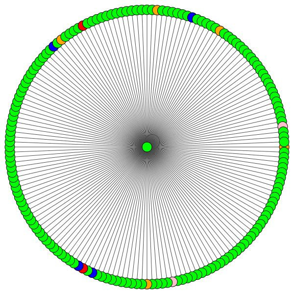
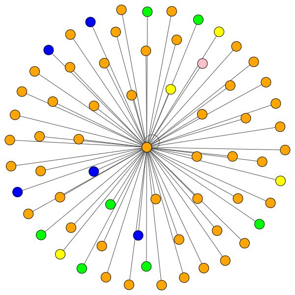

## GAT - Graph Attention Network (PyTorch) 
This repo contains a PyTorch implementation of the original GAT paper (:link: [Veličković et al.](https://arxiv.org/abs/1710.10903)). <br/>
It's aimed at making it **easy to start playing and learning** about GAT and GNNs in general. <br/>

## Setup

So we talked about what GNNs are, and what they can do for you (among other things). <br/>
Let's get this thing running! Follow the next steps:

1. `git clone https://github.com/gordicaleksa/pytorch-GAT`
2. Open Anaconda console and navigate into project directory `cd path_to_repo`
3. Run `conda env create` from project directory (this will create a brand new conda environment).
4. Run `activate pytorch-gat` (for running scripts from your console or setup the interpreter in your IDE)

That's it! It should work out-of-the-box executing environment.yml file which deals with dependencies. <br/>

-----

PyTorch pip package will come bundled with some version of CUDA/cuDNN with it,
but it is highly recommended that you install a system-wide CUDA beforehand, mostly because of the GPU drivers. 
I also recommend using Miniconda installer as a way to get conda on your system.
Follow through points 1 and 2 of [this setup](https://github.com/Petlja/PSIML/blob/master/docs/MachineSetup.md)
and use the most up-to-date versions of Miniconda and CUDA/cuDNN for your system.

## Usage

#### Option 1: Jupyter Notebook

Just run `jupyter notebook` from you Anaconda console and it will open up a session in your default browser. <br/>
Open `The Annotated GAT.ipynb` and you're ready to play!

---

**Note:** if you get `DLL load failed while importing win32api: The specified module could not be found` <br/>
Just do `pip uninstall pywin32` and then either `pip install pywin32` or `conda install pywin32` [should fix it](https://github.com/jupyter/notebook/issues/4980)!

#### Option 2: Use your IDE of choice

You just need to link the Python environment you created in the [setup](#setup) section.

### Training GAT

FYI, my GAT implementation achieves the published results:
* On Cora I get the `82-83%` accuracy on test nodes
* On PPI I achieved the `0.973` micro-F1 score (and actually even higher)

---

Everything needed to train GAT on Cora is already setup. To run it (from console) just call: <br/>
`python training_script_cora.py`

You could also potentially:
* add the `--should_visualize` - to visualize your graph data
* add the `--should_test` - to evaluate GAT on the test portion of the data
* add the `--enable_tensorboard` - to start saving metrics (accuracy, loss)

The code is well commented so you can (hopefully) understand how the training itself works. <br/>

The script will:
* Dump checkpoint *.pth models into `models/checkpoints/`
* Dump the final *.pth model into `models/binaries/`
* Save metrics into `runs/`, just run `tensorboard --logdir=runs` from your Anaconda to visualize it
* Periodically write some training metadata to the console

Same goes for training on PPI, just run `python training_script_ppi.py`. PPI is much more GPU-hungry so if
you don't have a strong GPU with at least 8 GBs you'll need to add the `--force_cpu` flag to train GAT on CPU.
You can alternatively try reducing the batch size to 1 or making the model slimmer.

You can visualize the metrics during the training, by calling `tensorboard --logdir=runs` from your console
and pasting the `http://localhost:6006/` URL into your browser:

<p align="center">


</p>

*Note: Cora's train split seems to be much harder than the validation and test splits looking at the loss and accuracy metrics.*

Having said that most of the fun actually lies in the `playground.py` script.

### Tip for understanding the code

I've added 3 GAT implementations - some are conceptually easier to understand some are more efficient.
The most interesting and hardest one to understand is implementation 3.
Implementation 1 and implementation 2 differ in subtle details but basically do the same thing.

**Advice on how to approach the code:**
* Understand the implementation #2 first
* Check out the differences it has compared to implementation #1
* Finally, tackle the implementation #3

### Profiling GAT

If you want to profile the 3 implementations just set the the `playground_fn` variable to `PLAYGROUND.PROFILE_GAT` in `playground.py`.

There are 2 params you may care about:
* `store_cache` - set to `True` if you wish to save the memory/time profiling results after you've run it
* `skip_if_profiling_info_cached` - set to `True` if you want to pull the profiling info from cache

The results will get stored in `data/` in `memory.dict` and `timing.dict` dictionaries (pickle).

*Note: implementation #3 is by far the most optimized one - you can see the details in the code.*

---

I've also added `profile_sparse_matrix_formats` if you want to get some familiarity with different matrix sparse formats
like `COO`, `CSR`, `CSC`, `LIL`, etc.

### Visualization tools

If you want to visualize t-SNE embeddings, attention or embeddings set the `playground_fn` variable to `PLAYGROUND.VISUALIZE_GAT` and
set the `visualization_type` to:
* `VisualizationType.ATTENTION` - if you wish to visualize attention across node neighborhoods
* `VisualizationType.EMBEDDING` - if you wish to visualize the embeddings (via t-SNE)
* `VisualizationType.ENTROPY` - if you wish to visualize the entropy histograms

And you'll get crazy visualizations like these ones (`VisualizationType.ATTENTION` option):

<p align="center">


</p>

On the left you can see the node with the highest degree in the whole Cora dataset.

If you're wondering about why these look like a circle, it's because I've used the `layout_reingold_tilford_circular` layout 
which is particularly well suited for tree like graphs (since we're visualizing a node and its neighbors this
subgraph is effectively a `m-ary` tree).

But you can also use different drawing algorithms like `kamada kawai` (on the right), etc.

Feel free to go through the code and play with plotting attention from different GAT layers, plotting different node
neighborhoods or attention heads. You can also easily change the number of layers in your GAT, although [shallow GNNs](https://towardsdatascience.com/do-we-need-deep-graph-neural-networks-be62d3ec5c59)
tend to perform the best on [small-world](https://en.wikipedia.org/wiki/Small-world_network), homophilic graph datasets.

---

If you want to visualize Cora/PPI just set the `playground_fn` to `PLAYGROUND.VISUALIZE_DATASET` and you'll get the results [from this README](#cora-visualized).

## Hardware requirements

HW requirements are highly dependent on the graph data you'll use. If you just want to play with `Cora`, you're good to go with a **2+ GBs** GPU.

It takes (on Cora citation network):
* ~10 seconds to train GAT on my RTX 2080 GPU
* 1.5 GBs of VRAM memory is *reserved* (PyTorch's caching overhead - far less is allocated for the actual tensors)
* The model itself has only 365 KBs!

Compare this to hardware needed even for the smallest of [transformers](https://github.com/gordicaleksa/pytorch-original-transformer#hardware-requirements)!

On the other hand the `PPI` dataset is much more GPU-hungry. You'll need a GPU with **8+ GBs** of VRAM, or you
can reduce the batch size to 1 and make the model "slimmer" and thus try to reduce the VRAM consumption.

### Future todos:

* Figure out why are the *attention coefficients equal to 0* (for the PPI dataset, second and third layer)
* Potentially add an implementation leveraging PyTorch's `sparse API`

If you have an idea of how to implement GAT using PyTorch's sparse API please feel free to submit a PR.
I personally had difficulties with their API, it's in beta, and it's questionable whether it's at all possible
to make an implementation as efficient as my implementation 3 using it.

Secondly, I'm still not sure why is GAT achieving reported results on PPI while there are some obvious numeric
problems in deeper layers as manifested by all attention coefficients being equal to 0.

## Learning material

If you're having difficulties understanding GAT I did an in-depth overview of the paper [in this video:](https://www.youtube.com/watch?v=uFLeKkXWq2c&ab_channel=TheAIEpiphany)

<p align="left">
<a href="https://www.youtube.com/watch?v=uFLeKkXWq2c" target="_blank"></a>
</p>

I also made a [walk-through video](https://www.youtube.com/watch?v=364hpoRB4PQ) of this repo (focusing on the potential pain points), 
and a blog for [getting started with Graph ML](https://gordicaleksa.medium.com/how-to-get-started-with-graph-machine-learning-afa53f6f963a) in general! :heart:

I have some more videos which could further help you understand GNNs:
* [My overview of the GCN paper](https://www.youtube.com/watch?v=VyIOfIglrUM)
* [My overview of the GraphSAGE paper](https://www.youtube.com/watch?v=vinQCnizqDA)
* [My overview of the PinSage paper](https://www.youtube.com/watch?v=ed0NJdqwEyg)
* [My overview of Temporal Graph Networks (TGN)](https://www.youtube.com/watch?v=0tw66aTfWaI)

## Acknowledgements

I found these repos useful (while developing this one):

* [official GAT](https://github.com/PetarV-/GAT) and [GCN](https://github.com/tkipf/gcn)
* [PyTorch Geometric](https://github.com/rusty1s/pytorch_geometric)
* [DeepInf](https://github.com/xptree/DeepInf) and [pyGAT](https://github.com/Diego999/pyGAT)

## Citation

If you find this code useful, please cite the following:

```
@misc{Gordić2020PyTorchGAT,
  author = {Gordić, Aleksa},
  title = {pytorch-GAT},
  year = {2020},
  publisher = {GitHub},
  journal = {GitHub repository},
  howpublished = {\url{https://github.com/gordicaleksa/pytorch-GAT}},
}
```

## Licence

[](https://github.com/gordicaleksa/pytorch-GAT/blob/master/LICENCE)
